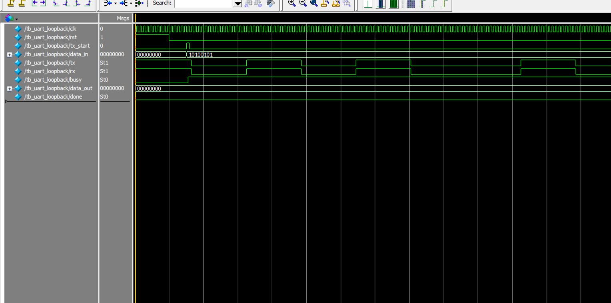

# UART TX/RX with Loopback Testbench

This repository contains a basic UART transmitter and receiver written in Verilog, with a testbench demonstrating loopback functionality.

## 📁 Files

- `uart_tx.v` – UART transmitter module.
- `uart_rx.v` – UART receiver module.
- `tb_uart_loopback.v` – Testbench to verify TX/RX functionality via loopback (tx → rx).
- `wave_tb_uart_loopback.png` – Simulation waveform screenshot.

## 🔁 Loopback Test Description

The testbench sends a byte (`0xA5`) from `uart_tx` to `uart_rx` via a loopback line (`assign rx = tx`). Upon successful reception, the simulation stops.

### Transmission Flow:
1. Testbench sets `tx_start = 1` with data `0xA5`
2. UART TX sends start bit, 8 data bits, and stop bit.
3. UART RX samples the line and reconstructs the byte.
4. When reception is complete, `done` goes high.

## 🖥️ Waveform

Below is the simulation result using ModelSim (100MHz clock, 16x oversampling):



You can see:
- Start bit transmission
- Serial data (bit-by-bit)
- Reception shift register building data
- `done` signal asserting when done

## 🧪 How to Simulate

1. Use ModelSim or equivalent simulator
2. Compile all three files:
   ```tcl
   vlog uart_tx.v
   vlog uart_rx.v
   vlog tb_uart_loopback.v
3. Run the simulation:
```tcl
vsim work.tb_uart_loopback
run -all
